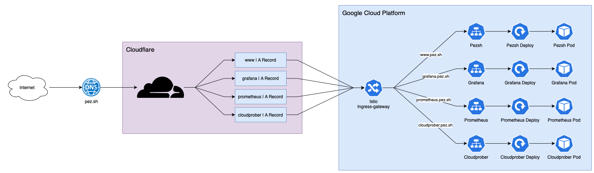

# pez-k8s
Personal GKE kubernetes stack

## Infrastructure

Below an overview of the current infrastructure.



### Cloudflare
I went with Cloudflare to provide easy security and analytics for the traffic going through `pez.sh`

Install is easy - setting the namespaces on a domain level to point to cloudflare and running the quick setup to clone DNS records

Cloudflare is also supported by terraform which is pretty cool

### Google Cloud
The project's brain is hosted in GKE

## File Structure
_sidenote: I'm switching to helm on another branch in this repo, stucture will change soon_
```
.
├── README.md
├── skaffold.yml
└── <module name>
    ├── manifests
    │   ├── ...
    │   └── <any kind of k8s yaml>
    └── src
        ├── ...
        ├── <supporting files/folders for image>
        └── Dockerfile
```

## Modules
|Module|Status|Description|SLA|
|---|---|---|---|
|`pez.sh`|Implemented|Personal website/portfolio|99.99%|
|`service-mesh`|Implemented|Istio control plane, gateway on pez.sh pointing to various virtual-services|
|`cloudprober`|Implemented|Provide uptime monitoring for pez.sh|
|`grafana`|Implemented|Grafana stuff|99.99%|
|`prometheus`|Implemented|Prometheus|
|`phoenix`|Development|Phoenix API for the [Phoenix](https://github.com/rwejlgaard/Phoenix) project|99.99%|
|`redis`|Implemented|redis service for future projects|
|`file-storage`|Implemented|Personal cloud storage (AFP)|
|`alertmanager`|Planned|Alerting using cloudprober metrics to maintain SLA on other modules|
